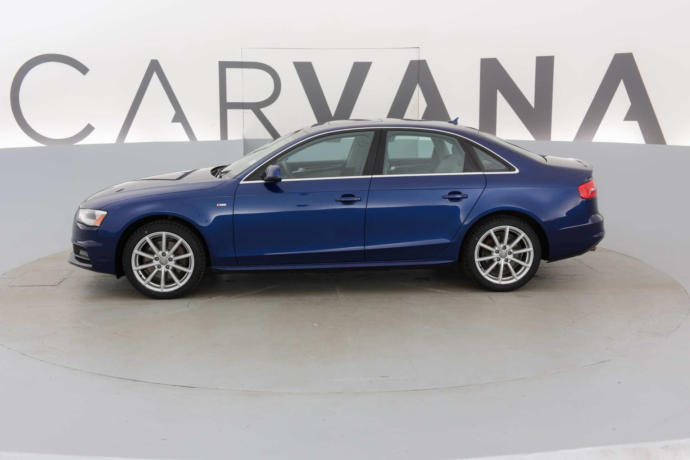

# unet-rgb

Keras(TF backend) implementation of unet for RGB pictures.

---

## Overview
### Requirement
- OpenCV
- Python 3.7
- Tensorflow-gpu > 2.x
- Keras

### Data
- Leather Dataset: 
- Input images: resize (512x512x3)
- Mask images: resize (512x512)

- ```leather/train``` Input images for train folder.
- ```leather/trainannot``` Mask images for train folder.
- ```leather/test``` Input images for test folder.
- ```leather/testannot``` Mask images for test folder.
- ```leather/val``` Input images for validate folder.
- ```leather/valannot``` Mask images for validate folder.
- ```npydata/``` save the .npy file from ```python data_leather.py```
- ```results/``` save the .npy & leather.txt file from ```python predict_leather.py```
- ```results/val``` save the mask image from predict or ```python test2mask2pic.py```

- for CamVid Dataset:https://github.com/preddy5/segnet/tree/master/CamVid

### Howtouse
- extract downloaded data to corresponding directories
- run ```python data.py``` to generate 3 .npy files or you can download them to npydata
- run ```python unet.py``` to train, you can change hyperparameters on your own situation
- run ```python test2mask2pic.py``` to get test results(pictures)

### Results




### Leather
- run ```python data_leather.py```
- run ```python unet_leather.py```
- run ```python predict_leather.py```
- run ```python test2mask2pic.py```
After 50 epochs training, loss goes to about 4e-04 and acc is 0.9644.


## About
Unet is mostly used in medical areas. I used this model for semantic segmentation of satellite remote sensing images in real work and the result is not bad. I think one of the reason is that it's a coarse-grained task like medical image analysis. Of course, enough labeled images are necessary.

## Reference
https://github.com/zhixuhao/unet
